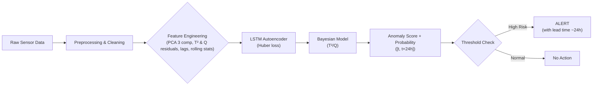

# ML System Design Document — Predictive Maintenance

## Зачем идем в разработку продукта?

**Проблема:**  
На металлургическом производстве ПАО «Северсталь» эксгаустеры (промышленные вытяжные вентиляторы / дымососы) подвержены неплановым остановкам (M1-события), которые приводят к остановке технологических линий, длительным простоям производства и значительным финансовым потерям.

Текущий процесс обслуживания:  
- Планово-предупредительный ремонт по фиксированному графику → приводит к замене ещё исправных деталей и перерасходу ресурсов.  
- Реактивный ремонт по факту поломки → вызывает непредсказуемые простои, вторичные повреждения оборудования и убытки.

**Цель проекта:**  
Разработать систему предиктивного обслуживания (Predictive Maintenance), которая позволит предсказывать неплановые остановки за ~24 часа заранее на основе анализа сенсорных данных (температура, вибрация, давление и др.). Это обеспечит переход к ремонту «по состоянию», минимизируя внеплановые простои, снижая затраты на ТО и повышая надёжность производства.

**Польза от ML:**  
- Автоматическое выявление скрытых аномалий в многомерных временных рядах, недоступное ручному мониторингу.  
- Снижение количества внеплановых простоев на 20–50% (оценочно, по отраслевым бенчмаркам).  
- Оптимизация запасов запчастей и планирования ремонтов.

## Бизнес-требования и ограничения

**Требования:**  
- Заблаговременное предупреждение о риске M1 (горизонт предсказания [t, t+24h]).  
- Высокий precision (≥ 0.80–0.85) — минимизация ложных алертов, которые приводят к ненужным остановкам оборудования.  
- Регулярное переобучение модели на новых данных.  
- Интерпретируемость предсказаний (визуализация T²/Q статистик для анализа причин).  

**Ограничения:**  
- Данные конфиденциальны (NDA ПАО «Северсталь», обезличенные промышленные телеметрия).  
- Ограниченные вычислительные ресурсы: модель должна быть компактной, инференс на CPU.  
- Частота обновления данных: 1 раз в час / сутки (batch-режим).  

## Что входит / не входит в скоуп проекта (итерация 1)

**Входит:**  
- Сбор, очистка и агрегация исторических данных сенсоров (10-секундная → часовая дискретизация).  
- Разработка baseline-модели и основной модели (LSTM-автоэнкодер + Bayesian на T²/Q).  
- Реализация пайплайна для пакетной обработки (batch scoring).  
- Сохранение результатов предсказаний в базу данных / файл.  
- Batch-инференс и генерация алертов.

**Не входит (на данной итерации):**  
- Разработка дашборда / UI для операторов.  
- Автоматическая интеграция с ERP-системой заказа запчастей.  
- Streaming-обработка данных в реальном времени (Kafka / Spark).  
- Полноценный пилот на производстве (только прототип + shadow-режим).

## Предпосылки решения

- Доступны исторические данные сенсоров эксгаустеров (обезличенные).  
- В данных присутствуют размеченные события: M1 (неплановые остановки, 72 шт.), M3 (функциональные деградации / аномалии, 898 шт.).  
- Данные имеют временную структуру, несбалансированность классов (M1 редкие), пропуски и выбросы.

## Постановка задачи

**Тип задачи:** Бинарная классификация временных рядов + детекция аномалий.  
**Таргет:** Вероятность / score риска неплановой остановки в горизонте [t, t+24h].  
**Входные данные:**  
- Многомерные временные ряды сенсоров (температура масла/подшипников, вибрация, давление и др.).  
- Метаданные: id оборудования, timestamp.  

**Метрики:**  
- ROC-AUC, Precision, Recall, F1-score для событий M1.  
- Precision@k (ограниченное число алертов).  
- Бизнес-метрика: снижение downtime (оценочно ≥20%).

**Выход:** Score риска + lead time до потенциального M1 (~24 ч).

## Блок-схема решения

## Этапы решения задачи

### Этап 1. Подготовка данных

#### Описание данных и сущностей
Данные представляют собой обезличенные промышленные телеметрии эксгаустеров.

**Основные сущности:**
- **Сенсорные сигналы** — многомерные временные ряды с частотой 10 секунд: температура, вибрация, давление и др. (несколько десятков параметров).
- **Журнал сообщений** — события: M1 (неплановые остановки, 72 шт.), M3 (функциональные деградации/аномалии, 898 шт.).
- **y_train** — разметка наличия M1 в будущем окне.

**Объём данных:** десятки тысяч записей на 51 техническое место, покрытие разметкой <60% оборудования.

#### Выявленные проблемы и риски (по результатам EDA)
- Несоответствия разметки: y_train и messages.csv не полностью совпадают → риск утечки/ошибок в таргете.
- Редкие события: M1 — крайне редкие (72 на весь датасет) → сильная несбалансированность.
- Пропуски и выбросы: ~5–10% пропусков, отрицательные значения, экстремальные пики (особенно в вибрации и температуре).
- Шум и нестационарность: разные режимы работы оборудования, сезонность/тренды.
- Покрытие: разметка доступна не для всех технических мест → риск обобщения модели.

**Риски:**
- Переобучение на шум/выбросы → mitigation: capping outliers, robust scaling.
- Недостаток положительных примеров → mitigation: unsupervised anomaly detection + фокус на эталонных периодах.

#### Процесс генерации данных
Данные собираются автоматически с контроллеров оборудования в реальном времени (секунды–минуты), агрегируются и обезличиваются на стороне заказчика. Предоставлены в виде CSV-файлов (Google Drive, ссылка в README репозитория). Процесс регулярный, но возможны пропуски из-за сбоев передачи/датчиков.

#### Недостаточность данных и способы решения
- Количество M1-событий недостаточно для чисто supervised подхода → решение: unsupervised pre-training на нормальных периодах + Bayesian на остатках.
- Дополнительные способы: расширение горизонта наблюдения, синтетические аномалии (GANs в будущем), transfer learning с похожего оборудования (если появятся данные).

#### Конфиденциальность данных
Данные не содержат персональной информации, но являются коммерчески чувствительными (промышленная телеметрия).

#### Необходимый результат этапа
- Очищенный и агрегированный датасет (часовая дискретизация).
- Выделенные эталонные (нормальные) периоды для обучения автоэнкодера.
- Обработанные пропуски, выбросы, нормализованные признаки.
- Сформированные временные окна (50 часов: 23 lead-in + 27 post).
- Разделение на train/val/test с учётом временной структуры (без leakage).

**Результаты EDA:** см. ноутбук `src/EDA.ipynb` в репозитории. Включает:
- Распределения сенсоров, корреляции.
- Анализ M1/M3 событий (причины, lead time).
- Визуализации: временные ряды, boxplots, heatmap корреляций.
- Выводы: вибрация и температура — ключевые предикторы остановок.

### Этап 2. Подготовка прогнозных моделей

#### Метрики и функции потерь
**Метрики (с учётом редкости событий и важности precision):**
- Precision, Recall, F1-score — основная оценка детекции M1.
- ROC-AUC — для ранжирования рисков.
- Precision@k — для ограниченного числа алертов (k ≈ 5–10 в день).
- Lead time (среднее время предупреждения) — ≥12–24 ч.
- Количество успешно предсказанных M1 (цель: ≥90%, в прототипе 61/61).

**Функции потерь:**
- Huber loss — для LSTM-автоэнкодера (устойчива к выбросам).
- Bayesian inference — для моделирования вероятности эволюции остатков.

**Обоснование:** Precision критичен (ложные алерты = ненужные остановки), Recall важен для покрытия большинства простоев.

#### Схема ML-валидации
- Временная валидация: TimeSeriesSplit / walk-forward validation (5–10 фолдов).
- Обучение на прошлом → валидация на будущем (без утечки данных из будущего).
- Hold-out на последних M1-событиях для финальной оценки.

#### Baseline-модель
- Простые пороговые правила на T²/Q статистиках (Hotelling + SPE).
- Классический ML: Random Forest / Gradient Boosting на агрегированных признаках (rolling mean/std, lags 1–5, скользящие статистики).

**Предобработка для baseline:**
- Масштабирование (StandardScaler).
- Формирование лагов и скользящих окон.
- Агрегация в фиксированные фичи.

#### Стратегии дальнейшего развития
- Расширение Feature Engineering: FFT, wavelet-трансформации, частотные признаки.
- Более сложные архитектуры: CNN-LSTM, Transformer-based encoder-decoder.
- Оптимизация гиперпараметров: Optuna / Bayesian Optimization.
- Ансамблирование: stacking LSTM + XGBoost на остатках.
- Добавление domain-специфичных фич (режимы работы, нагрузка).

#### Анализ и интерпретация модели
- Confusion matrix, PR-кривые, ROC-кривые.
- SHAP / LIME для интерпретации вклада фич и остатков.
- Визуализация реконструкции LSTM (аномальные сегменты).
- Анализ важности T²/Q перед M1-событиями.

#### Риски этапа и способы их снижения
- Переобучение на редких событиях → early stopping, dropout, weight decay.
- Data drift в проде → мониторинг распределений, regular retrain.
- Низкая обобщаемость → кросс-валидация по оборудованию.

#### Необходимый результат этапа
- Рабочая baseline-модель (пороги / Random Forest).
- Основная модель (LSTM + Bayesian) с воспроизводимым пайплайном.
- Оценка качества: Precision ≥0.80, Recall ≥0.90, 61/61 покрытых M1.
- Понимание сильных/слабых сторон (например, lead time ~24 ч).

### Этапы, специфичные для задачи Predictive Maintenance

1. **Feature Engineering временных рядов**  
   - Скользящие агрегаты (mean, std, min, max на окнах 10–60 мин).  
   - Лаговые признаки (1–5 шагов).  
   - Выделение трендов/сезонности (STL-декомпозиция).  
   - Частотные признаки (FFT на вибрации).  

2. **Сегментация временных последовательностей**  
   - Формирование окон наблюдения: 50 часов (23 часа до + 27 после).  
   - Выделение эталонных окон (без M1/M3 в ±50 ч).  
   - Предсказание отказа в будущем горизонте (24–27 ч).  

3. **Работа с редкими событиями**  
   - Обучение автоэнкодера только на нормальных данных.  
   - Балансировка: class weights / focal loss (если перейти к supervised).  
   - Пороговые стратегии: динамический threshold по ROC.  
   - Bayesian моделирование для оценки неопределённости предсказаний.

## Подготовка пилота

### Цели пилота
Провести контролируемую проверку работоспособности системы предиктивного обслуживания в условиях, максимально приближенных к реальным производственным, без влияния на технологический процесс.

**Основные цели:**
- Подтвердить, что модель даёт precision ≥ 0.80–0.85 и recall ≥ 0.90 на свежих данных (ложные алерты не превышают 15–20%).
- Оценить реальный lead time предупреждения (≥12–24 ч) и его влияние на планирование ремонтов.
- Проверить стабильность предсказаний и отсутствие сильного data drift за 1–3 месяца.
- Собрать доказательства ценности (value proof): снижение количества внеплановых простоев хотя бы на 15–25% на пилотной группе.
- Выявить операционные риски и доработать пайплайн перед полным внедрением.

### Объём и выбор пилотной группы
- **Количество оборудования:** 10–30% от парка эксгаустеров (примерно 10–30 единиц из ~100–150 на производстве).
- **Критерии выбора:**
  - Разнообразие типов эксгаустеров (разные цеха, разные режимы эксплуатации).
  - Наличие хотя бы 1–2 исторических M1-событий за последние 6–12 месяцев.
  - Доступ к сенсорным данным в реальном времени (или ежедневной выгрузке).

### Подготовительные шаги
1. Развёртывание пайплайна.
2. Настройка логирования: все предсказания, score, T²/Q статистики, ground truth (реальные M1/M3).
3. Настройка мониторинга: data drift (KS-test), model performance (precision/recall на накопленных данных).
4. Бэкап-план: fallback на baseline-пороги или отключение системы при деградации.

### Продолжительность пилота
- Минимально: 3 месяца (учитывая редкость M1-событий).
- Оптимально: 4–6 месяцев для набора достаточной статистики (минимум 5–10 реальных M1 на пилотной группе).

### Критерии успеха / Go / No-Go
| Метрика                              | Цель (успех)          | Критический провал      | Источник измерения          |
|--------------------------------------|------------------------|--------------------------|-----------------------------|
| Precision на пилотных данных         | ≥ 0.82                 | < 0.70                   | Логи предсказаний           |
| Recall на M1-событиях                | ≥ 0.90                 | < 0.60                   | Сравнение с фактическими M1 |
| Кол-во ложных алертов в месяц        | ≤ 3–5 на 20 ед.        | > 10                     | Логи + ручная верификация   |
| Средний lead time до M1              | ≥ 18–24 ч              | < 12 ч                   | Timestamp алерта vs M1      |
| Снижение downtime (оценочно)         | ≥ 20%                  | < 5%                     | Отчёты цеха / исторические  |
| Отсутствие значимого data drift      | KS-test p-value > 0.05 | p-value < 0.01           | Мониторинг распределений    |

**Go/No-Go решение:**
- Go: ≥80% критериев выполнено → масштабирование на весь парк.
- No-Go: <60% критериев или >10 ложных алертов/месяц → доработка модели/пайплайна.

### Риски пилота и mitigation
- Редкая частота M1 → мало статистики → mitigation: расширить пилотную группу или горизонт (6+ месяцев).
- Data quality в проде хуже исторических → mitigation: мониторинг дрейфа + fallback на baseline.
- Технические сбои (нет данных) → mitigation: retry-механизмы в Airflow, оповещение админов.

### Необходимый результат этапа
- Отчёт о пилоте (PDF / Notion / Confluence): цифры, графики (PR-кривые, confusion matrix, lead time distribution, drift-мониторинг).
- Рекомендация: масштабировать / дорабатывать / отказаться.
- Доказательства ценности: расчёт экономического эффекта (снижение downtime × стоимость часа простоя).

## 4. Внедрение

### 4.1. Архитектура решения

#### Описание компонентов

* **Sensor Data Storage**
  Хранилище исторических и новых данных сенсоров оборудования.

* **ETL / Preprocessing Job**
  Очистка данных: обработка пропусков, выбросов, нормализация, агрегация по временным окнам.

* **Feature Engineering**
  Формирование лаговых признаков, скользящих статистик, временных окон для LSTM-модели.

* **Model Inference Service**
  Batch-сервис инференса, рассчитывающий вероятность отказа оборудования в горизонте `[t, t+24h]`.

* **Predictions Storage**
  Хранилище результатов предсказаний, доступное для downstream-процессов.

* **Alerting / Reporting**
  Логика формирования тревожных сигналов при превышении порога риска.

* **Training Pipeline**
  Периодическое переобучение модели на обновлённых данных.

* **Model Registry**
  Хранение версий моделей, метаданных и метрик качества.

* **Model Monitoring**
  Мониторинг распределений входных данных и выходных скорингов, контроль дрейфа.

---

### 4.2. Описание инфраструктуры и масштабируемости

#### Выбранная инфраструктура

* **Docker** — контейнеризация всех компонентов
* **Batch-запуск через cron / Airflow**
* **Python (PyTorch / TensorFlow)** — обучение и инференс
* **PostgreSQL / файловое хранилище** — результаты и фичи
* **CPU-инстансы** (GPU не требуется на инференсе)

#### Плюсы

* Низкие инфраструктурные издержки
* Простота эксплуатации
* Высокая воспроизводимость

#### Минусы

* Нет мгновенной реакции на отказ
* Ограниченная применимость для real-time сценариев

#### Масштабирование

* Горизонтальное масштабирование batch-джобов
* Параллельный инференс по группам оборудования
* Возможность перехода к streaming-архитектуре

---

### 4.3. Требования к работе системы

#### SLA и быстродействие

| Параметр                          | Требование          |
| --------------------------------- | ------------------- |
| Частота инференса                 | 1 раз в час / сутки |
| Время обработки 1 оборудования    | ≤ 100 мс            |
| Время batch-прогона (1000 единиц) | ≤ 5 минут           |
| Доступность сервиса               | ≥ 99%               |
| Потеря данных                     | недопустима         |

---

### 4.4. Безопасность системы

#### Потенциальные уязвимости

* Неавторизованный доступ к данным сенсоров
* Утечка предсказаний

#### Меры защиты

* Ограничение доступа на уровне сети и ролей
* Хранение моделей и данных в защищённом контуре
* Логирование всех операций инференса и обучения

---

### 4.5. Безопасность данных

* Персональные данные отсутствуют
* Данные относятся к промышленной телеметрии
* Требуется соблюдение внутренних политик ИБ

---

### 4.7. Integration points

| Компонент        | Тип интеграции                     |
| ---------------- | ---------------------------------- |
| Хранилище данных | Batch-чтение (CSV / SQL)           |
| Инференс         | Python API                         |
| Результаты       | Запись в БД / файл                 |
| Алёрты           | Файлы / REST                       |
