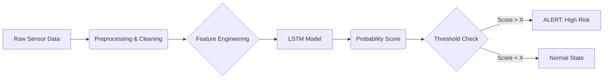

# ML System Design Document — Predictive Maintenance

## 1. Цель проекта
**Проблема:**
В настоящее время обслуживание оборудования производится либо по жесткому расписанию (планово-предупредительный ремонт), либо по факту поломки (реактивный ремонт).
*   Плановый ремонт неэффективен: меняются еще рабочие детали (лишние расходы).
*   Ремонт по факту поломки критичен: приводит к непредсказуемым простоям производства (Downtime) и возможным вторичным повреждениям оборудования.

**Цель:**
Внедрить систему предиктивного обслуживания (Predictive Maintenance), которая позволит переходить от планового ремонта к ремонту "по состоянию".

## 2. Бизнес-требования и ограничения
**Требования:**
*   Заблаговременное обнаружение потенциальных сбоев
*   Низкий процент ложноположительных срабатываний (precision важен).
*   Регулярное переобучение (работа с новой порцией данных).

### Ограничения:
*   Конфиденциальность и доступность данных.
*   Ограниченные вычислительные ресурсы (модель должна быть компактной).
*   Частота обновления данных: возможно, 1 час/сутки.

## 3. Скоуп (что входит / не входит)
### Входит:
*   Сбор и очистка исторических данных с датчиков.
*   Разработка baseline-модели и основной модели (LSTM) для детекции аномалий/предсказания сбоев.
*   Реализация pipeline для пакетной обработки данных (Batch Scoring).
*   Сохранение результатов предсказаний в базу данных/файл логов.

### Не входит:
*   Разработка дашборда (UI) для операторов.
*   Автоматическая интеграция с ERP-системой заказа запчастей.
*   Streaming-обработка данных в реальном времени (Kafka/Spark) — пока достаточно Batch.

## 4. Предпосылки
*   Есть исторические данные сенсоров.
*   В данных присутствуют размеченные события "Поломка" или аномальные периоды.
*   Наличие альтернативного решения от соседней команды, требуется провести сравнение различных подходов.

## 5. Постановка задачи
*   **Тип задачи:** Бинарная классификация временных рядов (Binary Classification on Time Series) / Детекция аномалий (Anomaly Detection).
*   **Таргет:** Вероятность отказа оборудования в окне `[t, t + 24h]`.
*   **Входные данные:** Временные ряды сенсоров, метаданные (id оборудования, timestamp).
*   **Метрики:** ROC-AUC, Precision@k, Recall, F1 для событий; бизнес: уменьшение downtime.

## 6. Архитектура решения (блок-схема)

## 7. Этапы решения задачи

---

### Этап 1. Подготовка данных

#### Описание данных и сущностей

В рамках проекта используются исторические данные сенсоров промышленного оборудования, представленные в виде многомерных временных рядов.  
Каждая запись содержит:
- временную метку;
- идентификатор оборудования;
- значения сенсорных показателей (температура, вибрация, давление);
- целевую метку, отражающую наличие или отсутствие отказа оборудования в будущем временном окне.

Целевая переменная формируется как бинарный признак, указывающий на факт отказа оборудования в интервале `[t, t + 24h]`.

По результатам EDA выявлены следующие особенности и проблемы:
- наличие пропусков в сенсорных показателях;
- различие масштабов признаков;
- шумы и выбросы в данных;
- сильная несбалансированность классов (отказы являются редкими событиями).

Эти факторы создают риски снижения устойчивости модели.

---

#### Процесс генерации данных

Данные формируются автоматически в процессе эксплуатации оборудования и поступают с промышленных датчиков и контроллеров.  
Сбор данных осуществляется регулярно (периодичность - от секунд до минут), после чего данные агрегируются и сохраняются в виде табличных файлов (CSV).

Исторические данные используются для обучения моделей в batch-режиме. Возможны пропуски временных шагов из-за сбоев передачи данных или технических ограничений оборудования.

---

#### Недостаточность данных и способы её решения

Основной проблемой является малое количество размеченных событий отказа. Для её решения возможны следующие подходы:
- расширение датасета за счёт данных с аналогичного оборудования;
- использование техник балансировки классов (oversampling, class weights);
- генерация синтетических примеров аномальных состояний;
- увеличение горизонта наблюдения до отказа.

---

#### Конфиденциальность данных

Данные не содержат персональной информации, однако являются коммерчески чувствительными.  
Требуется соблюдение внутренних политик безопасности.

---

#### Необходимый результат этапа

- очищенный и валидированный датасет;
- обработанные пропуски и выбросы;
- нормализованные признаки;
- сформированные временные окна для обучения моделей;
- разделение данных на обучающую, валидационную и тестовую выборки с учётом временной структуры.

---

### Этап 2. Подготовка прогнозных моделей

#### Метрики и функции потерь

С учётом бизнес-задачи и несбалансированности классов используются следующие метрики:
- **Precision, Recall, F1-score** — для оценки качества детекции отказов;
- **ROC-AUC** — для оценки ранжирования рисков;
- **Precision@k** — для сценариев ограниченного количества тревожных сигналов.

Основной акцент делается на Precision, так как ложноположительные срабатывания приводят к ненужным остановкам оборудования.

---

#### Схема ML-валидации

Так как данные имеют временную природу, применяется временная валидация:
- walk-forward / TimeSeriesSplit;
- разбиение по временным блокам без утечки будущей информации;
- обучение на прошлом, валидация на будущем.

---

#### Baseline-модель

В качестве baseline используются:
- классические ML-модели (Random Forest, Gradient Boosting) на агрегированных признаках;
- простая LSTM-модель для работы с последовательностями.

Предобработка включает:
- масштабирование признаков;
- формирование лаговых признаков и скользящих статистик;
- формирование входных последовательностей фиксированной длины.

---

#### Стратегии дальнейшего развития

- расширение Feature Engineering (частотные признаки, FFT);
- использование более сложных архитектур (CNN-LSTM, Transformer);
- оптимизация гиперпараметров (Grid Search, Bayesian Optimization);
- ансамблирование моделей.

---

#### Анализ и интерпретация модели

Для анализа работы моделей используются:
- confusion matrix;
- ROC и Precision-Recall кривые;
- анализ важности признаков;
- SHAP/LIME для интерпретации решений модели.

---

#### Риски этапа и способы их снижения

**Риски:**
- переобучение на редких событиях;
- деградация качества на новых данных;
- шум и дрейф данных.

**Способы снижения:**
- регулярное переобучение;
- контроль метрик на валидации;
- мониторинг распределений входных данных.

---

#### Необходимый результат этапа

- рабочая baseline-модель;
- воспроизводимый ML-pipeline;
- оценка качества моделей по выбранным метрикам;
- понимание сильных и слабых сторон решения.

---

### Этапы, специфичные для задачи Predictive Maintenance

#### Этап 3. Feature Engineering временных рядов
- построение скользящих агрегатов;
- лаговые признаки;
- выделение трендов и сезонности.

#### Этап 4. Сегментация временных последовательностей
- формирование окон наблюдения;
- предсказание отказа в будущем временном горизонте.

#### Этап 5. Работа с редкими событиями
- балансировка классов;
- использование пороговых стратегий;
- настройка бизнес-ориентированных порогов тревоги.
