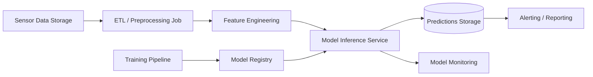

# ML System Design Document — Predictive Maintenance

## 4. Внедрение

### 4.1. Архитектура решения

#### Описание компонентов

* **Sensor Data Storage**
  Хранилище исторических и новых данных сенсоров оборудования.

* **ETL / Preprocessing Job**
  Очистка данных: обработка пропусков, выбросов, нормализация, агрегация по временным окнам.

* **Feature Engineering**
  Формирование лаговых признаков, скользящих статистик, временных окон для LSTM-модели.

* **Model Inference Service**
  Batch-сервис инференса, рассчитывающий вероятность отказа оборудования в горизонте `[t, t+24h]`.

* **Predictions Storage**
  Хранилище результатов предсказаний, доступное для downstream-процессов.

* **Alerting / Reporting**
  Логика формирования тревожных сигналов при превышении порога риска.

* **Training Pipeline**
  Периодическое переобучение модели на обновлённых данных.

* **Model Registry**
  Хранение версий моделей, метаданных и метрик качества.

* **Model Monitoring**
  Мониторинг распределений входных данных и выходных скорингов, контроль дрейфа.

---

### 4.2. Описание инфраструктуры и масштабируемости

#### Выбранная инфраструктура

* **Docker** — контейнеризация всех компонентов
* **Batch-запуск через cron / Airflow**
* **Python (PyTorch / TensorFlow)** — обучение и инференс
* **PostgreSQL / файловое хранилище** — результаты и фичи
* **CPU-инстансы** (GPU не требуется на инференсе)

#### Плюсы

* Низкие инфраструктурные издержки
* Простота эксплуатации
* Высокая воспроизводимость

#### Минусы

* Нет мгновенной реакции на отказ
* Ограниченная применимость для real-time сценариев

#### Масштабирование

* Горизонтальное масштабирование batch-джобов
* Параллельный инференс по группам оборудования
* Возможность перехода к streaming-архитектуре

---

### 4.3. Требования к работе системы

#### SLA и быстродействие

| Параметр                          | Требование          |
| --------------------------------- | ------------------- |
| Частота инференса                 | 1 раз в час / сутки |
| Время обработки 1 оборудования    | ≤ 100 мс            |
| Время batch-прогона (1000 единиц) | ≤ 5 минут           |
| Доступность сервиса               | ≥ 99%               |
| Потеря данных                     | недопустима         |

---

### 4.4. Безопасность системы

#### Потенциальные уязвимости

* Неавторизованный доступ к данным сенсоров
* Утечка предсказаний

#### Меры защиты

* Ограничение доступа на уровне сети и ролей
* Хранение моделей и данных в защищённом контуре
* Логирование всех операций инференса и обучения

---

### 4.5. Безопасность данных

* Персональные данные отсутствуют
* Данные относятся к промышленной телеметрии
* Требуется соблюдение внутренних политик ИБ

---

### 4.7. Integration points

| Компонент        | Тип интеграции                     |
| ---------------- | ---------------------------------- |
| Хранилище данных | Batch-чтение (CSV / SQL)           |
| Инференс         | Python API                         |
| Результаты       | Запись в БД / файл                 |
| Алёрты           | Файлы / REST                       |
