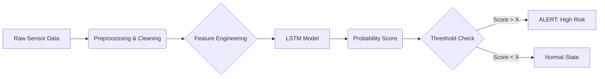

# ML System Design Document — Predictive Maintenance

## 1. Цель проекта
**Проблема:**
В настоящее время обслуживание оборудования производится либо по жесткому расписанию (планово-предупредительный ремонт), либо по факту поломки (реактивный ремонт).
*   Плановый ремонт неэффективен: меняются еще рабочие детали (лишние расходы).
*   Ремонт по факту поломки критичен: приводит к непредсказуемым простоям производства (Downtime) и возможным вторичным повреждениям оборудования.

**Цель:**
Внедрить систему предиктивного обслуживания (Predictive Maintenance), которая позволит переходить от планового ремонта к ремонту "по состоянию".

## 2. Бизнес-требования и ограничения
**Требования:**
*   Заблаговременное обнаружение потенциальных сбоев
*   Низкий процент ложноположительных срабатываний (precision важен).
*   Регулярное переобучение (работа с новой порцией данных).

### Ограничения:
*   Конфиденциальность и доступность данных.
*   Ограниченные вычислительные ресурсы (модель должна быть компактной).
*   Частота обновления данных: возможно, 1 час/сутки.

## 3. Скоуп (что входит / не входит)
### Входит:
*   Сбор и очистка исторических данных с датчиков.
*   Разработка baseline-модели и основной модели (LSTM) для детекции аномалий/предсказания сбоев.
*   Реализация pipeline для пакетной обработки данных (Batch Scoring).
*   Сохранение результатов предсказаний в базу данных/файл логов.

### Не входит:
*   Разработка дашборда (UI) для операторов (на этом этапе только API/Logs).
*   Автоматическая интеграция с ERP-системой заказа запчастей.
*   Streaming-обработка данных в реальном времени (Kafka/Spark Streaming) — пока достаточно Batch.

## 4. Предпосылки
*   Есть исторические данные сенсоров.
*   В данных присутствуют размеченные события "Поломка" или аномальные периоды.
*   Наличие альтернативного решения от соседней команды, требуется провести сравнение различных подходов.

## 5. Постановка задачи
*   **Тип задачи:** Бинарная классификация временных рядов (Binary Classification on Time Series) / Детекция аномалий (Anomaly Detection).
*   **Таргет:** Вероятность отказа оборудования в окне `[t, t + 24h]`.
*   **Входные данные:** Временные ряды сенсоров, метаданные (id оборудования, timestamp).
*   **Метрики:** ROC-AUC, Precision@k, Recall, F1 для событий; бизнес: уменьшение downtime.

## 6. Архитектура решения (блок-схема)

